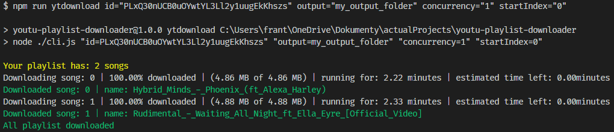

# youtu-playlist-downloader

is project which can help you download all your songs from your youtube playlist.

<!-- # [demo](https://youtu-playlist-downloader.lukasfrantal.com) -->


<hr>

## Instalation

```bash
npm i youtu-playlist-downloader -g
```

## Example running:

```bash
ytdownload id="PLxQ30nUCB0uOatryEd7sgS0GfdMHgGvsN"
```

default `output` setting path for folder is `./` you can add your custom path like this:

```bash
ytdownload id="PLxQ30nUCB0uOatryEd7sgS0GfdMHgGvsN" output="./playlist"
```

you can define your `concurrency` setting which represents how many songs you want to download from the playlist at once. By default is `1`, if you will not define it. For example 30 songs at once:

```bash
ytdownload id="PLxQ30nUCB0uOatryEd7sgS0GfdMHgGvsN" output="./playlist" concurrency="30"
```

you can define `startIndex` which represents from which order you want to start downloading a song from the list. By default is from the start.

```bash
ytdownload id="PLxQ30nUCB0uOatryEd7sgS0GfdMHgGvsN" output="./playlist" concurrency="30" startIndex="10"
```

### command line arguments:

- `id` is expected settings where you can define id of your playlist
- `output` is output path where you want download your songs, The argument is not expected settings by default is `./`
- `concurrency` define max number of parallel downloads, argument is not expected settings by default is `1`
- `startIndex` define start order position in your playlist for start downloading, argument is not expected settings by default is `0`.

## You can use this package for your next solution, function downloadYutubePlaylist for downloading all your youtube playlist songs.

```js
const path = require('path');
const { downloadYutubePlaylist } = require('youtu-playlist-downloader');

const idPlaylist = 'PLxQ30nUCB0uNCCKBD_JW1udM7iYH27cu2';
const output = path.resolve(`./playlist`);
const concurrency = 30;
const startIndex = 0;
downloadYutubePlaylist(output, idPlaylist, concurrency, startIndex);
```

## If you want donwload only one song you can do it with function downloadYutubeSong like this.

```js
const path = require('path');
const { downloadYutubeSong } = require('youtu-playlist-downloader');

const idSong = 'UCtaTjkogAC3Xh5J-ZPdX0BQ';
const output = path.resolve(`./playlist`);
const nameSong = 'Name of the song';
downloadYutubeSong(output, idSong, nameSong);
```

## Expected incorrect result will be show in your console like this:


## Expected correct result if you defined correct your youtube playlist id, output, concurrency, startIndex:

<br>
